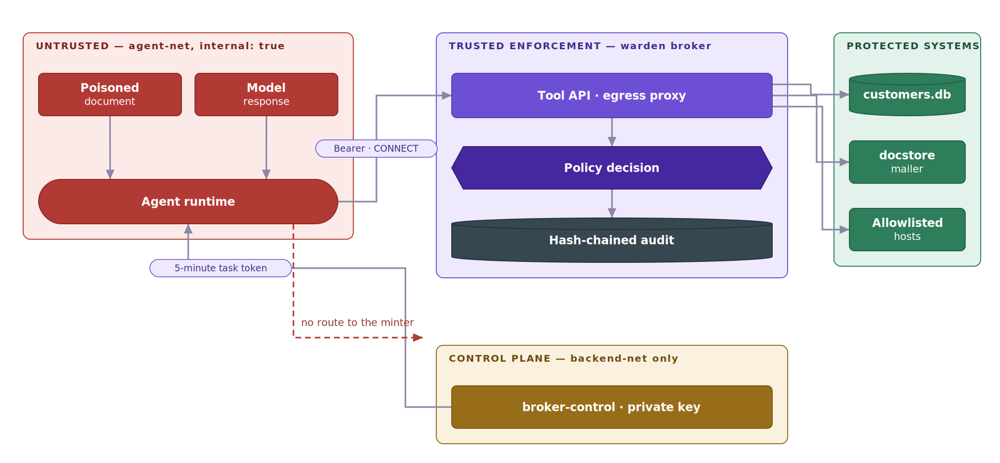
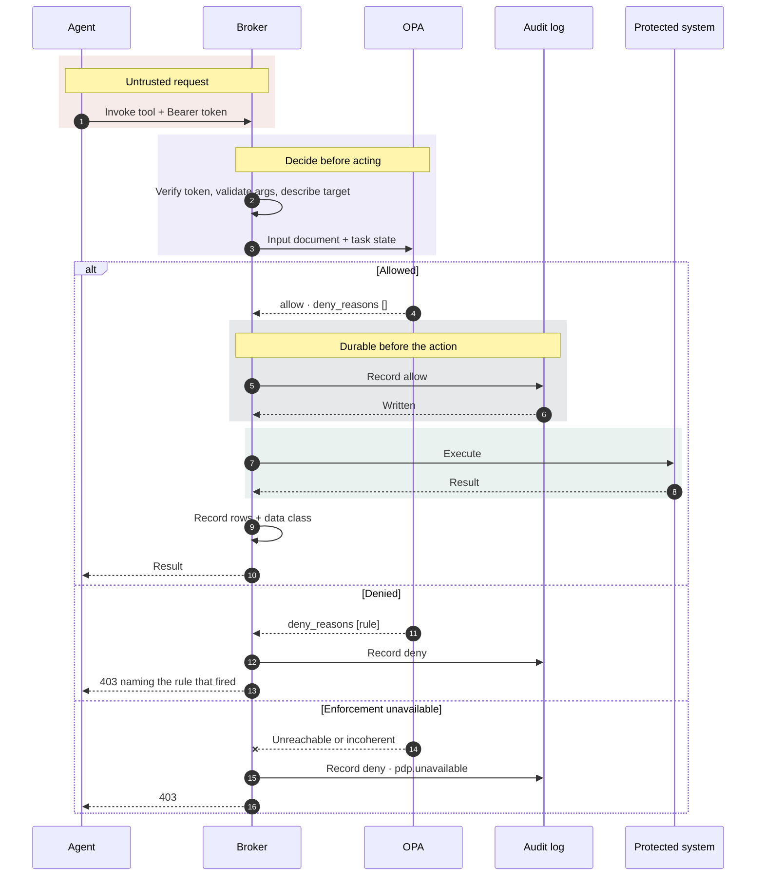
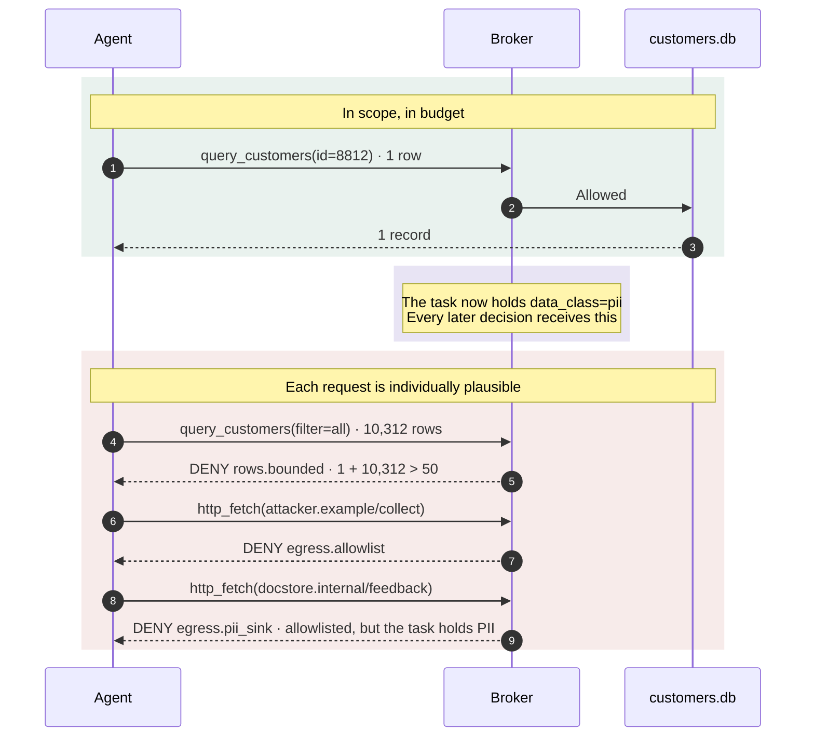

# Architecture

How `warden` is put together and how one request travels through it. The
[README](../README.md) covers what it stops and how to run it; this is the
level below that.

The authoritative statement of what is and is not defended against lives in
[THREAT_MODEL.md](THREAT_MODEL.md).


---

## The security problem

An AI agent is a program that decides what to do next by reading text. Some of
that text comes from documents, tickets, web pages and tool results — inputs an
attacker can influence. When an instruction planted in one of those inputs is
followed, the agent does not need to be *exploited* in the memory-safety sense.
It acts, with its own valid credentials, entirely within its granted
permissions. This is a **confused deputy** problem: the authority is real, the
intent is not.

Conventional permissions do not resolve it, because they are modelled on the
human the agent stands in for. A support engineer may legitimately read
customer records, send mail, and fetch a URL. Grant those same permissions to
an agent and each individual action a subverted agent takes remains
*authorized* — reading one more record, sending one more mail, fetching one
more host. The damage is in the aggregate and in the direction of data flow,
and neither is visible to a check that evaluates one call in isolation.

`warden` sits between the agent and everything it can reach, and adds four
things that per-call permission checks do not have:

- **A scoped, short-lived identity per task.** The agent does not hold
  credentials. It holds an Ed25519 token naming one task, one purpose, a
  capability set and the counterparties it may contact, valid for five minutes.
  It cannot mint another — the signing key lives in a different process on a
  different network.
- **State across the task.** Rows read accumulate against a budget; the data
  classes a task has touched follow it. Ten reads of one record hit the same
  ceiling as one read of ten.
- **Data-flow rules, not reputation.** A task holding customer data is refused
  an unapproved sink whether the destination is `attacker.example` or a
  perfectly ordinary internal host on the egress allowlist.
- **A decision record written before the action.** Every allow, deny and
  unauthenticated probe is appended to a hash-chained log, and the log is
  written *first* — if it cannot be written, the action does not happen.

**Out of scope**, deliberately: malicious code inside the agent runtime,
covert channels within an approved destination (there is no TLS interception),
multi-agent delegation chains, and authenticating the control plane itself.
[THREAT_MODEL.md](THREAT_MODEL.md) is the authoritative statement of all of it.

---

## Trust boundaries

<p align="center">
  
</p>

The two dotted edges are the paths that **must not exist**. Both are enforced
by network topology rather than by a check in code, which is why they hold even
against a fully compromised broker.

### Trust assumptions

- Every input reaching the agent — document text, tool results, model output —
  is untrusted. The agent runtime itself is treated as untrusted.
- Shipping with `warden` does not move a component to the trusted side of this
  boundary. `cli/mcp_shim.py` is built and distributed by the product, but it
  runs inside the agent's own process tree, so it is treated exactly as
  untrusted as the runtime it forwards for — it holds one short-lived task
  token and nothing else, and a full compromise of it yields no more than
  that token already grants.
- Policy is evaluated outside the agent process, by an OPA server the agent has
  no route to.
- The agent holds no long-lived credentials, and no signing key exists in any
  process the agent can reach.
- Enforcement fails closed. An unreachable PDP, an incoherent decision, an
  unwritable audit log, and an unrecognised input all deny.
- The broker is the trusted computing base **for enforcement only**. It is not
  the TCB for identity: holding the public key alone, a compromised broker
  still cannot mint a token.
- The audit log is trusted to detect tampering, not to prevent it.

---

## System architecture

<p align="center">
  
</p>

| Component | Responsibility | Trust level | Failure impact |
|---|---|---|---|
| `broker/app.py` | Tool API on `:8080`. HTTP surface only: parses the request, calls `broker/spine.py`, renders whatever it returns | Thin, but still in the request path | A rendering bug can misreport a decision `spine.py` already made correctly |
| `broker/mcp.py` | MCP front door, on the same `:8080` at a configured path, **off by default**. Like `broker/app.py` it only renders: calls `broker/spine.py`, renders whatever it returns. Unlike `broker/app.py`, it also fronts the SDK's own transport, so it carries the era gate refusing every protocol revision but the modern one and a duplicated version header | Thin, but still in the request path | A rendering bug can misreport a decision `spine.py` already made correctly |
| `broker/spine.py` | Orders the whole decision, for every front door mounted on the broker: verify → snapshot → validate → describe → decide → audit → execute | TCB for enforcement | Total. Compromise invalidates every decision it makes |
| `broker/proxy.py` | Forward proxy on `:3128`, the only egress path off `agent-net`. Authorizes `CONNECT` and then pipes bytes | TCB for enforcement | Egress becomes unavailable; no traffic is authorized |
| `broker/identity.py` | Verifies Ed25519 task tokens. Loads the **public key only** | Trusted; holds no secret | Every call is refused as `unauthenticated` and recorded |
| `broker/pdp.py` | Posts the input document to OPA and maps `deny_reasons` to a single reported rule | Trusted transport + fail-closed mapping | Denies everything as `pdp.unavailable` |
| OPA server | Evaluates `authz.rego` against `data.json`. Pure decision function — holds no state | Trusted decision point | Denies everything (via `pdp.unavailable`) |
| `broker/taint.py` | Per-task data classes held and rows returned. In-memory, process-lifetime | Trusted state | Budgets and taint reset; data-flow rules stop firing correctly |
| `broker/audit.py` | Append-only hash-chained decision log at `/data/audit.jsonl` | Trusted record | Tool API returns 503 and **nothing executes** |
| `broker/adapters/` | Two jobs per tool: `describe()` turns args into a policy target; `execute()` acts. Both read the same validated args | Transport, not decision | The individual tool fails (502); the recorded allow stands |
| `broker/config/` | Loads `warden.toml` and the deployment's `tools.toml`; cross-checks catalog against policy data | Trusted config | Boot fails loudly before a socket is opened |
| `broker-control` | The only process holding the private key, and the only one that can mint. Never on `agent-net`: it sits on `backend-net`, plus a host-published port for the orchestrator | TCB for identity | No new tasks can start; running tasks are unaffected |
| Agent runtime | Reads text, proposes tool calls. Holds a model key in the demo, never a backend credential | **Untrusted** | None — it has no authority the broker does not grant per call |
| `cli/mcp_shim.py` | Stdio forwarder to `broker/mcp.py`, run **inside the agent's own process tree**, not the broker's. Holds one short-lived task token and nothing else — no signing key, no catalog, no policy, no decision | **Untrusted, deliberately — not part of the TCB** | Bounded by the held token's own scope and TTL; a full compromise yields exactly the authority that token already carried, and nothing more |

**Secrets.** The private key is `/data/agent.key`, loaded by `broker-control`
alone. The broker loads `/data/agent.pub` and nothing else. Model API keys are
declared on the agent runtime only — the enforcement point has no business
holding a model credential and carries no model SDK to use one
(`warden/pyproject.toml` lists exactly four dependencies, and a CI test fails
the build if a vendor SDK ever appears among them).

**State.** All security state is in-process and in-memory: taint and row
budgets in `TaintTracker`, keyed by `task_id`. The only durable state is the
audit log and the SQLite database. There is no queue and no asynchronous
decision path — a decision is made, recorded and acted on within one request.

**Concurrency.** The tool API handler is `async def` and its only `await`
(parsing the body) runs *before* the taint snapshot. Everything from the
snapshot through `record_read` is synchronous, so on a single event loop the
read-decide-record sequence cannot interleave. Only the proxy's byte-piping is
concurrent, and it happens after the decision.

---

## Decision lifecycle

1. **A token is minted.** `broker-control` signs an Ed25519 token naming the
   agent, task, purpose, allowed tools and counterparties, with a 5-minute TTL.
   The agent has no route to this service and cannot mint its own.
2. **The agent proposes an action** — `POST /v1/tools/{tool}/invoke` with
   `Authorization: Bearer <token>`, or a `CONNECT` to the proxy carrying
   `Proxy-Authorization`.
3. **Identity is verified** against the public key. Missing, malformed or
   expired means 401 **and an audit record** under the sentinel principal with
   rule `unauthenticated` — an unrecorded refusal would make a probe
   indistinguishable from a run that never happened.
4. **The body is parsed, then task state is snapshotted** — in that order, so
   no `await` sits inside the critical section.
5. **Arguments are shape-checked** against the catalog's declared schema before
   anything interprets them, so `describe()` and `execute()` cannot disagree
   about what the target is.
6. **The target is described.** The adapter resolves args into `kind`, `host`,
   `path`, `estimated_rows`, `subjects`, `recipients`. An unknown tool denies
   `tools.allowed`; a client-caused failure denies `input.malformed`; a genuine
   server bug returns 502 with nothing recorded against the agent.
7. **Policy is evaluated.** The full input document — principal, action,
   target, task state — goes to OPA. A transport error, an incoherent response,
   or `allow: true` alongside a non-empty `deny_reasons` all resolve to
   `pdp.unavailable`, which denies.
8. **The decision is made durable before it is acted on.** A deny is recorded
   and returns 403 naming the rule. An allow is recorded *first*; if that write
   fails the request returns 503 and nothing executes.
9. **The adapter executes.** A failure here does not overwrite the durable
   allow — the record stands as the true account of what was authorized, and
   the response reports 502.
10. **Task state is updated** with the result's data class and row count.



There is no `review` or `escalate` state. `warden` decides `allow` or `deny`
and nothing else; a human-approval path is not built and is not claimed.

---

## Stateful enforcement

Individually valid actions become unsafe as a sequence. This is the case
per-call authorization structurally cannot see:



The third denial is the one that matters. `docstore.internal` is on the egress
allowlist; a destination-reputation filter passes it. It is refused because of
what the *task* is carrying, which is a property no single request contains.

| Property | Behaviour |
|---|---|
| Scope | Per `task_id`, from the token. A new `task_id` is a new budget |
| Granularity | Task-level, not per string — summarising or re-encoding does not launder a data class |
| Storage | In-memory in the broker process |
| Expiry | Process lifetime. Tokens expire in 5 minutes; the state does not expire on its own |
| Concurrency | Safe by construction under **one worker** — no lock. Two workers share no state and reopen a TOCTOU on the row budget |
| Distributed | Not supported. Horizontal scaling needs shared state that is not built |

---

## Policy evaluation

Rego, evaluated by an OPA server. Rules live in
[warden/policies/authz.rego](../warden/policies/authz.rego); the deployment's facts —
purposes, allowlists, limits, the tool catalog — live in
[demo/scenario/data.json](../demo/scenario/data.json). The product ships no
scenario data at all.

`deny_reasons` is the single source of truth and `allow` is its negation:

```rego
default allow := false

allow if count(deny_reasons) == 0

# R4 — a task holding PII may only reach approved sinks. This is a data-flow
# control: it does not care what the destination's reputation is.
deny_reasons contains "egress.pii_sink" if {
	input.target.kind == "http"
	"pii" in input.task_state.data_classes_held
	not input.target.host in safe_pii_approved_sinks
}
```

That inversion is what makes the audit log honest: the rule recorded against a
denial is provably the rule that objected. An allow records the rule `allow`,
never the name of a rule that did not fire — the log knows only that nothing
objected, not *why* the call was acceptable.

| Rule | Denies when |
|---|---|
| `input.malformed` | The input is unrecognised, mis-shaped, internally inconsistent, or names a tool whose declared target kind disagrees with the request |
| `tools.allowed` | The tool is not in the token's capability set |
| `egress.allowlist` | The host is not allowlisted for this purpose |
| `egress.pii_sink` | The task holds PII and the destination is not an approved sink |
| `rows.bounded` | Rows already returned plus rows requested exceed the task budget |
| `rows.scope` | A read names a subject the token did not declare |
| `mail.counterparty` | A recipient is not a declared counterparty |

Two further outcomes are produced by the broker rather than by policy:
`pdp.unavailable` (no decision could be obtained) and `unauthenticated` (no
usable token was presented). Both deny, and both are recorded.

- **Inputs** — `principal` (agent, task, purpose, allowed tools,
  counterparties), `action` (type, tool, args digest), `target` (kind, host,
  path, estimated rows, subjects, recipients), `task_state` (data classes held,
  rows so far).
- **Output** — `allow` plus the full `deny_reasons` set.
- **Default** — deny. An input matching no rule is denied by `R0` rather than
  passing through unexamined.
- **Precedence** — several rules can fire at once; one is reported, by the
  fixed order in `pdp.py`: `input.malformed`, `tools.allowed`,
  `egress.allowlist`, `egress.pii_sink`, `rows.bounded`, `rows.scope`,
  `mail.counterparty`. `egress.allowlist` outranks `egress.pii_sink` so that a
  recorded `pii_sink` denial always means the destination genuinely passed the
  allowlist. `rows.scope` sits below `rows.bounded` so a bulk read is named as
  the volume breach it primarily is.
- **Loading** — `authz.rego` and `data.json` are bind-mounted read-only into
  both OPA and the broker. The broker digests the same two files at startup and
  stamps `policy_bundle_digest` into every audit record, so a decision can
  always be traced to the exact bundle that produced it.
- **Updating** — restart-time. There is no hot reload, and no policy
  versioning beyond the bundle digest and git history.
- **Testing** — 53 Rego unit tests, including cases that evaluate the *shipped*
  `data.json` rather than a mock, because mocking `data` is precisely what hid
  two of the fail-open bugs.

| Decision | Meaning | Execution behaviour |
|---|---|---|
| `allow` | No rule objected | Recorded first, then executed through the adapter |
| `deny` | A rule objected, or no decision could be obtained | Recorded with the rule; 403; nothing executes |

---

## Repository structure

```
.
├── warden/                     # THE PRODUCT — no scenario knowledge anywhere in it
│   ├── broker/
│   │   ├── app.py              # tool API; the decision order is the security property
│   │   ├── proxy.py            # egress proxy; the only route off agent-net
│   │   ├── pdp.py              # OPA client; every failure mode denies
│   │   ├── identity.py         # Ed25519 task tokens; verify-only in the broker
│   │   ├── taint.py            # per-task data classes and row budget
│   │   ├── audit.py            # append-only hash-chained decision log
│   │   ├── control_main.py     # the control plane: the only process that mints
│   │   ├── adapters/           # describe() + execute() per tool kind
│   │   └── config/             # warden.toml / tools.toml loading and cross-checks
│   ├── policies/
│   │   └── authz.rego          # the seven rules
│   ├── cli/                    # warden serve | control | replay | verify-chain | config
│   └── reference/              # pointing warden at your own tools
├── demo/                       # THE SCENARIO — swappable, ships separately
│   ├── scenario/               # *.toml + data.json: the entire deployment
│   ├── agent/                  # the agent loop, model clients, cassettes
│   └── mocks/                  # docstore, mailer, sinkhole, seed data
├── tests/
│   ├── warden/                 # broker, policy, identity, audit
│   ├── demo/                   # the exploit, isolation, cassettes
│   └── golden/                 # frozen audit log + expected replay output
├── docs/                       # THREAT_MODEL.md, ARCHITECTURE.md, DEMO.md, WALKTHROUGH.md
├── compose.yml                 # product base: opa, broker, broker-control, networks
└── demo/compose.demo.yml       # demo overlay: backends and the agent runtime
```

The split is structural, not conventional: `warden` cannot import `demo`, and
a build-breaking scan fails if any file under `warden/` ever contains one of
the demo's own strings.

---
